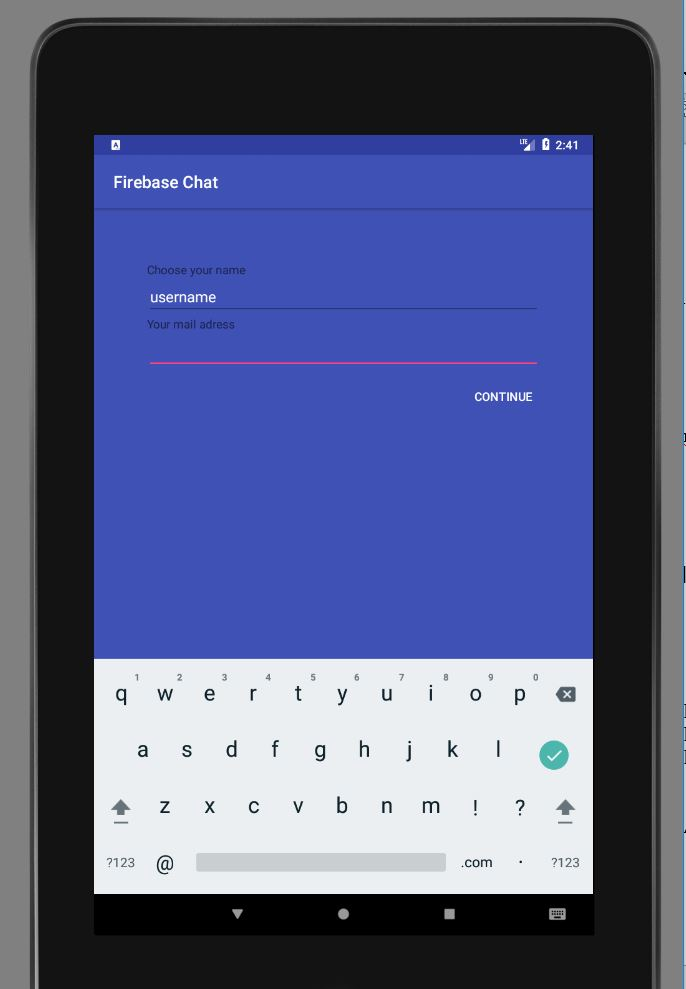
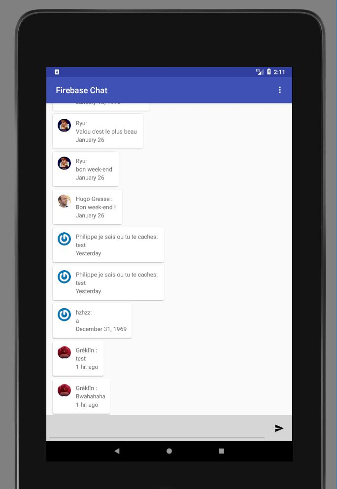
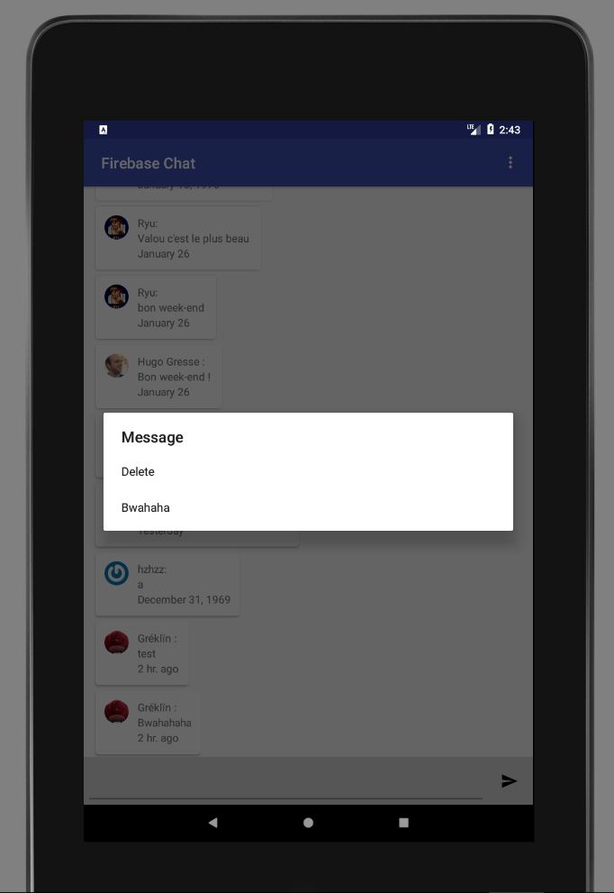
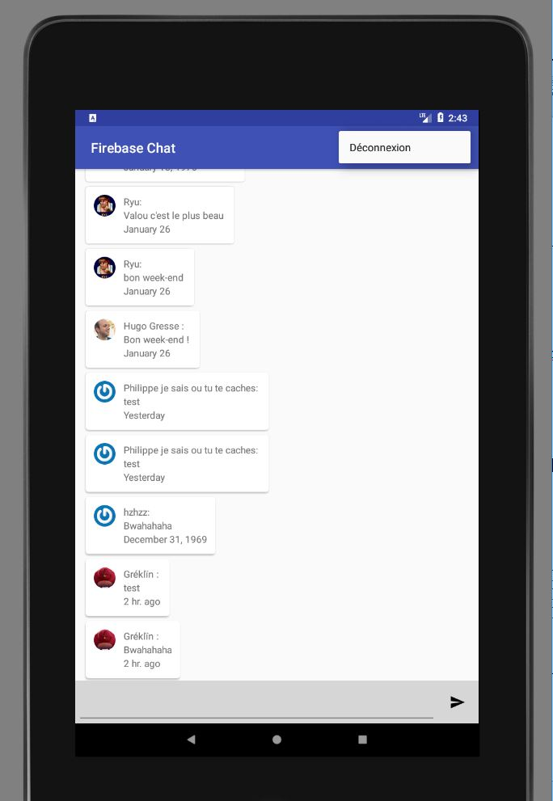

# TP_Android

Messagerie instantannée réalisée dans le cours d'Android dans le cadre de la LP ACPI de l'iut de Montpellier.

### Fonctionnalités:

  * Login 
  * Envoie de messages instannées
  * Suppression de messages
  * Modification de messages envoyés avec le texte "BWAHAHA"
  
### Installation:
  
1. Télécharger l'APK [release](release/release.apk)
2. Transferer l'APK sur votre mobile android
3. executer l'APK

### Capture d'écrans:

##### License:[GPLv3](https://github.com/RumblingBee/TP_Android/blob/master/LICENSE)
